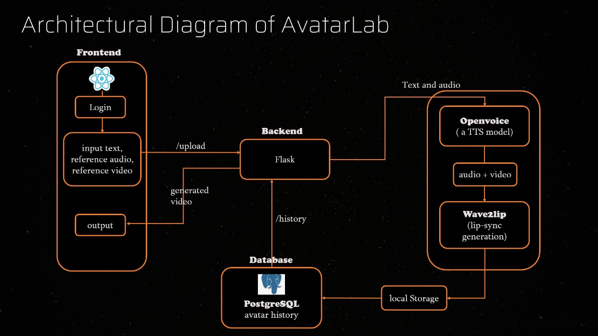
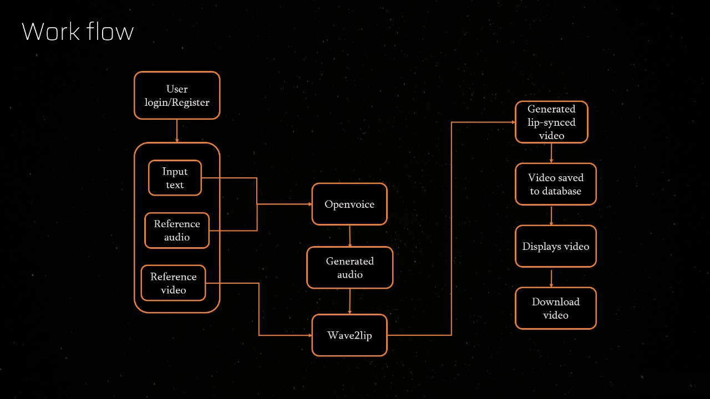

# 🎭 Avatar Lab
This project is an end-to-end application that generates realistic lip-synced avatar videos from user-input text and media using *OpenVoice* and *Wave2Lip*. The system allows users to log in, submit text and a reference video/audio, and receive a downloadable lip-synced video in return.
## 🛠 Tech Stack

| Component              | Technology         |
|------------------------|--------------------|
| Frontend               | React.js           |
| Backend                | Flask              |
| Database               | PostgreSQL              |
| TTS Model              | OpenVoice          |
| Lip Sync Generation    | Wav2Lip            |
## 🧩 Architecture Diagram

## 🔄 Workflow

## ⚙ Features

-  User authentication (Register/Login)
-  Convert input text to speech using OpenVoice
-  Generate lip-synced video using Wave2Lip
-  Save generation history for each user
-  Download or view generated avatar videos
  
# 🗣 Wav2Lip: A Lip Sync Expert

Wav2Lip is an AI model designed to generate lip-synced videos from any audio and video input. Its architecture is built around a Generative Adversarial Network (GAN) framework, encompassing a generator, a discriminator, and a pre-trained lip-sync expert network.

## ✅ Strengths
- Highly Accurate Lip Synchronization
- Visual Quality Improvement
- Versatile

## ⚠ Limitations
- Low Resolution Output
- Temporal Inconsistency
- Handling Extreme Conditions

The objective of Wav2Lip is to achieve highly accurate and visually consistent lip-syncing in videos, irrespective of the speaker, voice, or language involved.

---

# 🔊 OpenVoice: Versatile Instant Voice Cloning

OpenVoice is a versatile open-source system designed for instant voice cloning (IVC) and flexible speech synthesis. Its architecture tackles the challenge of replicating a speaker's voice (tone color) while allowing independent control over various other speech styles, such as emotion, accent, rhythm, pauses, and intonation. This is achieved through a decoupled framework composed primarily of two main components: a Base Speaker TTS (Text-to-Speech) model and a Tone Color Converter.

## ✅ Strengths
- Accurate Tone Color Cloning
- Flexible Voice Style Control
- Zero-Shot Cross-Lingual Voice Cloning
- High Efficiency

## ⚠ Limitations
- Accent and Emotional Range & Pronunciation Issues
- Dependency on Base TTS Model
- Data Quality and Variety

The primary objective of OpenVoice is to provide a versatile and efficient solution for instant voice cloning and speech synthesis. It focuses on decoupling voice style control (emotion, accent, rhythm, etc.) from tone color cloning, allowing users to manipulate these aspects independently.

---
## 📚 Main References
- *Wav2Lip: A Lip Sync Expert Is All You Need for Speech to Lip Generation In The Wild*: The original research paper by Prajwal K.P., Rudrabha Mukhopadhyay, Vinay P. Namboodiri, and CV Jawahar, published at ACM Multimedia 2020. You can find the paper on arXiv: arXiv.
- *OpenVoice: Versatile Instant Voice Cloning*: The original research paper by Zengyi Qin, Wenliang Zhao, Xumin Yu, and Xin Sun. You can find it on arXiv: arXiv.

## 🧪 Models Explored
### TTS Models
- Small-E

- F5TTS

- XTTS

### Lip-Sync Generation Models
- DiffTalk

- LatentSync

- SadTalker

## 🖥 Installation and SetUp
1. **Clone the repository and navigate to the frontend folder**
     ```bash
     cd frontend22

2. **Set up and install dependencies**

   ```bash
   npm run setup

3. **Download Checkpoints**

   [Click here to download the model checkpoints](https://drive.google.com/drive/folders/1qVSyMyBpvr71MMoA8WhG4KPUVbT1UwVc?usp=drive_link)

   After downloading, extract the files to the following directory:
   ```bash
   /backend/flask1/files/checkpoints

4. **Start the Server**
   ```bash
   npm start
   
## 👥 Contributors
| Member           | Milestone 1 Video                                 | Milestone 2 Video                                 |
|------------------|---------------------------------------------------|---------------------------------------------------|
| Monish Soni    | [MileStone1](https://drive.google.com/file/d/1SIm4n1pAo_QOwA3u1v1srL46eauqUReK/view?usp=sharing)      | [MileStone2](https://drive.google.com/file/d/1mVQqmrW1qATUpR7zkHBtforh22FGTLli/view?usp=sharing)      |
| Mallepalli Samantha    | [MileStone1](https://drive.google.com/file/d/1yr50cDtmlmXch4ukYI8h_8SBMp-0lO77/view?usp=sharing)     | [MileStone2](https://drive.google.com/file/d/1slFB_5cb4sD7N_auxJemPFWJyZz3BQ4Z/view?usp=sharing)     |
| Ashrita Rachuri  | [MileStone1](https://drive.google.com/file/d/13iCnueiFYvlzmlH0AA9lo9atG_CfdKfy/view?usp=sharing)      | [MileStone2](https://drive.google.com/file/d/148cORJ8Ksr3HSDAWWipCWMNjpHpnVtcX/view?usp=sharing)     |
| Ramya Kammari    | [MileStone1](https://drive.google.com/file/d/1o_Ci1splZyYGVQIfXHr1f5VgNHtQ2CVr/view?pli=1)      | [MileStone2](https://drive.google.com/file/d/1bPQCRn7Rd8aLMBh5orxM0TvxTgtbiLT1/view)      |
| Pappu Divya    | [MileStone1](https://drive.google.com/file/d/1nhcGnbqXa5KPkBSTZeDrsMRE_tCdnCoa/view)      | [MileStone2](https://drive.google.com/file/d/1QENFxiYIlZwbMnz4gNLglhnpr-3t0IY_/view?usp=sharing)      |
| Adapa Tejaswini    | [MileStone1](https://drive.google.com/file/d/1C1S6g3eoI6XRHf51DwNH5shvc3xW0AnW/view)      | [MileStone2](https://www.youtube.com/watch?v=dYu_hTikluM)      |
